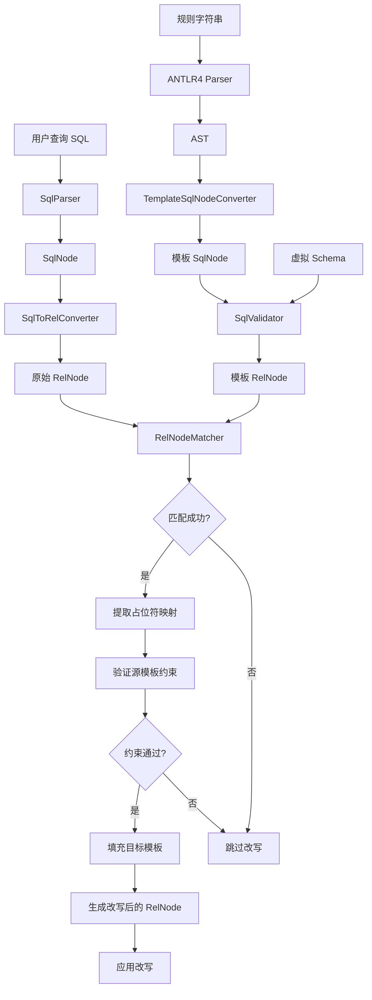
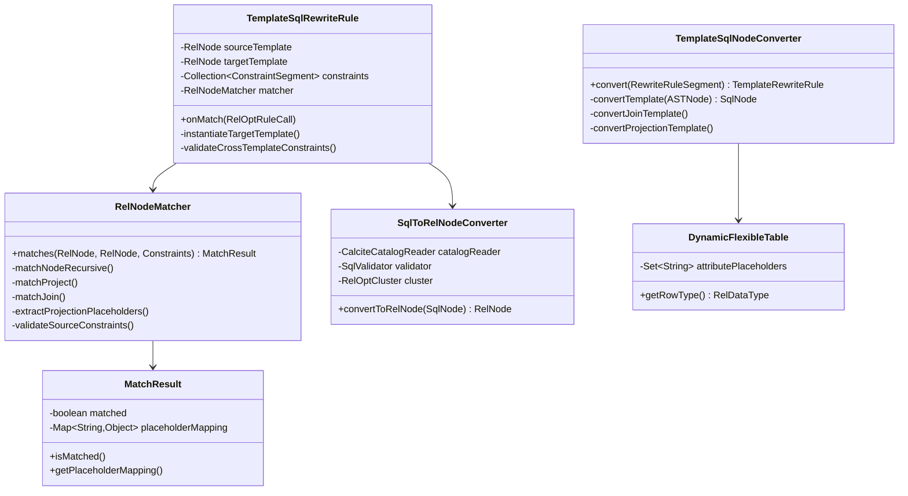
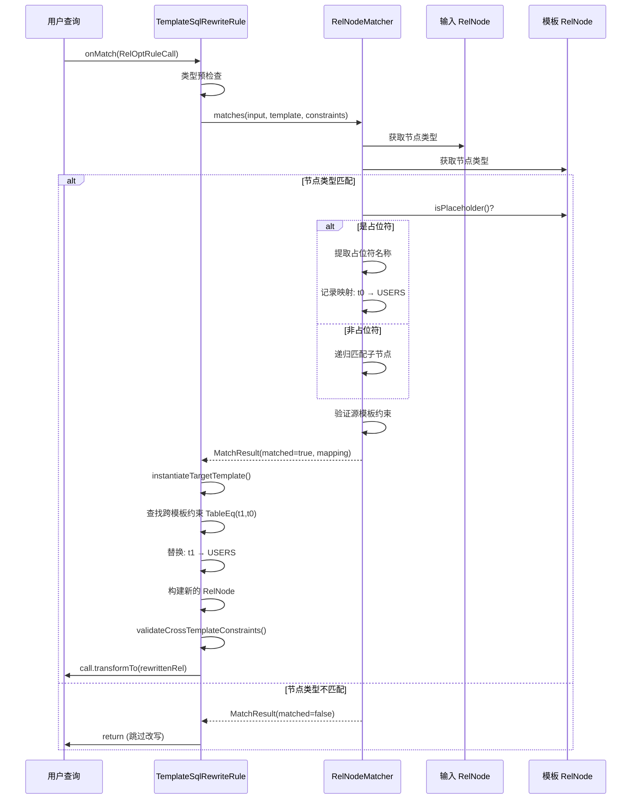
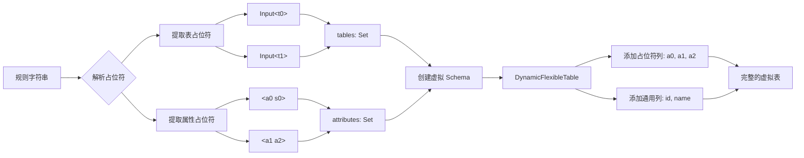
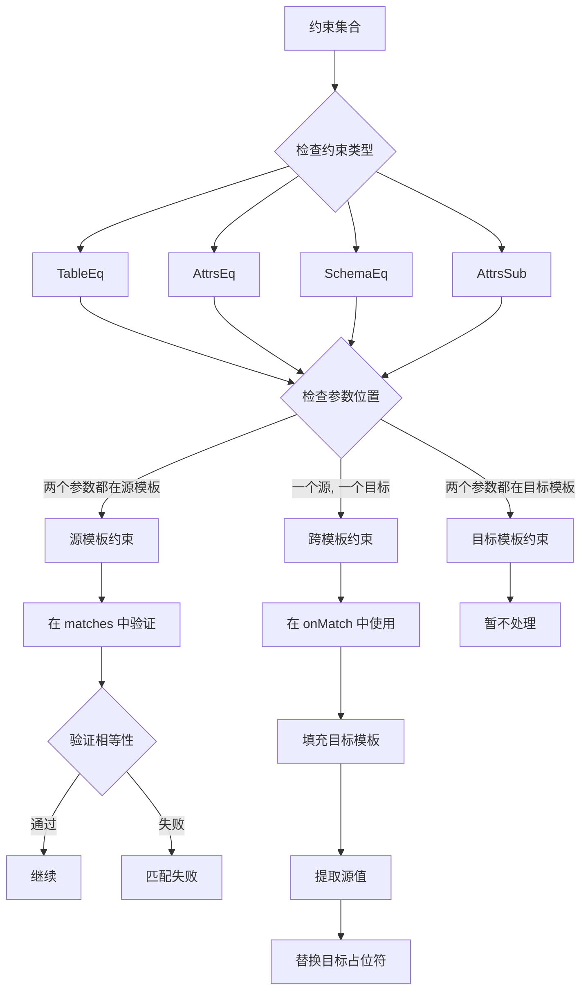
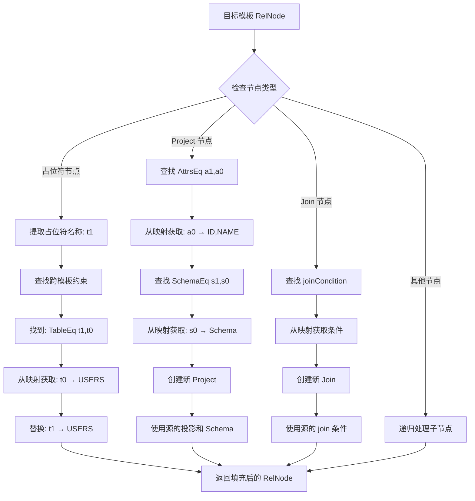
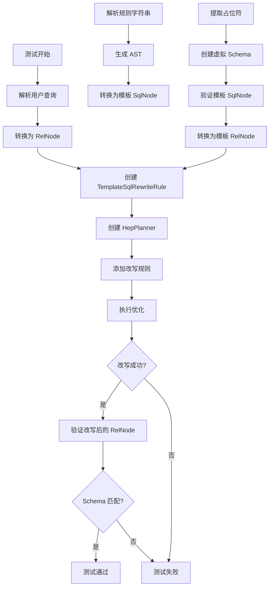
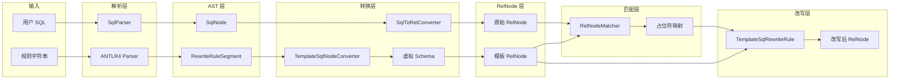

# 系统架构图

## 1. 整体流程图

## 2. 组件关系图

## 3. 匹配流程序列图

## 4. 占位符提取流程

## 5. 约束验证流程

## 6. 目标模板填充流程

## 7. 测试流程图

## 8. 数据流图

---

这些图表可以在支持 Mermaid 的 Markdown 查看器中查看，如：
- GitHub
- GitLab
- Typora
- VS Code (with Mermaid extension)

